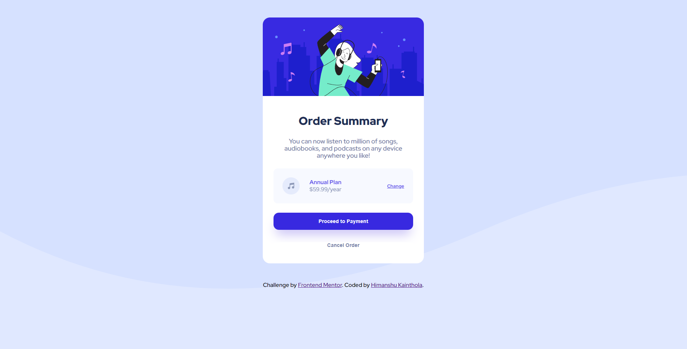

# Frontend Mentor - Order summary card solution

This is a solution to the [Order summary card challenge on Frontend Mentor](https://www.frontendmentor.io/challenges/order-summary-component-QlPmajDUj). Frontend Mentor challenges help you improve your coding skills by building realistic projects. 

## Table of contents

- [Overview](#overview)
  - [The challenge](#the-challenge)
  - [Screenshot](#screenshot)
  - [Links](#links)
- [My process](#my-process)
  - [Built with](#built-with)
  - [What I learned](#what-i-learned)
- [Author](#author)

## Overview
This is a simpe order summary comoponent page which contains an image as a background and the content in the center of the page. In the content section there is an image, a description, a pricing section and two buttons in it. The price section and buttons change its color when mouse hover on them.

### The challenge

Users should be able to:

- See hover states for interactive elements

### Screenshot

### Links

- Solution URL: [https://github.com/himanshukainthola/order-summary-component]
- Live Site URL: [https://himanshukainthola.github.io/order-summary-component/]

## My process

My process was simple first I created a page layout using apropiate html tags and then styled those html tags by using CSS.
- Created a div container to contain all the elements of the page.
- Inside that div container I add the image and one more container which containd the   discription and the buttons.
- Within the second div container there is three sections first contains the text, the middle one contains the the pricing information and the last contains two buttons.
- Afte this I style the page by adding background image and the font-family.
- Then I Centered the main Div container and styled the image inside it.
- In second div container I used flexbox properties to cente and align the elements of the container.
- Finally at last I styled the button and the added the hover effect to the button.

### Built with

- HTML
- CSS custom properties
- Flexbox

### What I learned

In this challenge I learned multiple things like:
- Css Flexbox properties and its use cases
- Centering and positioning of elements
- Changing state of buttons

## Author

- Frontend Mentor - [https://www.frontendmentor.io/profile/himanshukainthola]
- Twitter - [https://twitter.com/him_anshu_dev]
